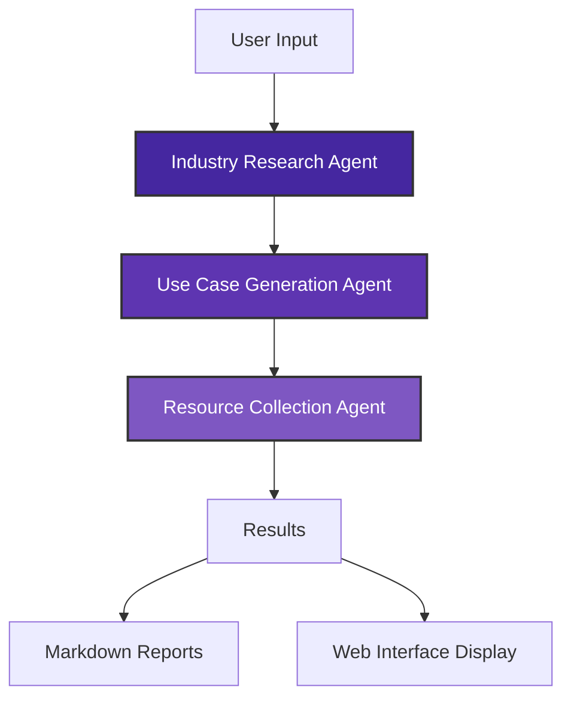

# Market Research & Use Case Generation Multi-Agent System

## Project Overview
This project implements a multi-agent architecture system that generates relevant AI and Generative AI (GenAI) use cases for a given company or industry. The system conducts market research, understands the industry and product, and provides resource assets for AI/ML solutions, focusing on enhancing operations and customer experiences.

## Architecture
The system consists of three specialized AI agents working together in a sequential process:

1. **Industry Research Agent**: Researches and analyzes the industry or company to understand its segment, key offerings, and strategic focus areas.

2. **Use Case Generation Agent**: Generates relevant AI and GenAI use cases based on industry research that can improve processes, enhance customer satisfaction, and boost operational efficiency.

3. **Resource Asset Collection Agent**: Finds relevant datasets and resources for implementing the proposed AI use cases from platforms like Kaggle, HuggingFace, and GitHub.



## Setup Instructions

### Prerequisites
- Python 3.8 or higher
- OpenAI API key
- Tavily API key (for advanced search capabilities)

### Installation

1. Clone the repository or download the source code

2. Install the required dependencies:
   ```bash
   pip install -r requirements.txt
   ```

3. Set up your API keys:
   - You can enter your API keys directly in the web interface, or
   - Create a `.env` file with the following content:
     ```
     OPENAI_API_KEY=your-openai-api-key
     TAVILY_API_KEY=your-tavily-api-key
     ```

## Usage

### Command Line Interface
You can run the system from the command line:

```bash
python market_research_agent.py
```

You will be prompted to enter an industry or company name, and the system will generate use cases and resources.

### Web Interface
For a more user-friendly experience, you can use the Streamlit web interface:

```bash
streamlit run app.py
```

This will open a web browser where you can:
1. Enter your API keys in the sidebar
2. Input an industry or company name
3. View the generated research, use cases, and resources in separate tabs

## Output
The system generates three types of output:

1. **Industry Research**: A comprehensive analysis of the industry or company, including segment, key offerings, strategic focus areas, challenges, opportunities, and competitive landscape.

2. **AI Use Cases**: 10-15 relevant AI and GenAI use cases that can benefit the company or industry, each with a clear objective, AI application description, and cross-functional benefits.

3. **Implementation Resources**: A list of datasets, research papers, open-source tools, and industry benchmarks that could be used to implement each use case.

All outputs are saved as markdown files in the project directory and displayed in the web interface.

## Example Use Cases

The system can generate use cases like:

### AI-Powered Predictive Maintenance
- **Objective**: Reduce equipment downtime and maintenance costs
- **AI Application**: Machine learning algorithms analyze sensor data to predict failures
- **Benefits**: Minimizes downtime, extends equipment lifespan, reduces costs

### Real-Time Quality Control with Computer Vision
- **Objective**: Enhance product quality by detecting defects during manufacturing
- **AI Application**: AI-powered computer vision systems identify defects in real-time
- **Benefits**: Improves defect detection, reduces scrap rates, enhances customer satisfaction

### AI-Enabled Knowledge Management System
- **Objective**: Improve employee productivity with easy access to company knowledge
- **AI Application**: GenAI-powered chatbot for querying internal documents
- **Benefits**: Accelerates onboarding, reduces support queries, enhances collaboration

## Technologies Used

- **CrewAI**: For creating and orchestrating the multi-agent system
- **LangChain**: For building the agent capabilities and tools
- **Streamlit**: For the web interface
- **DuckDuckGo Search & Tavily Search**: For web research capabilities

## Customization

You can customize the system by:

1. Modifying the agent definitions in `market_research_agent.py`
2. Adjusting the task descriptions to focus on specific aspects of interest
3. Adding additional agents for more specialized tasks
4. Enhancing the web interface in `app.py`

## Limitations and Future Work

- The system relies on the quality of the search results from DuckDuckGo and Tavily
- The generated use cases are based on general industry knowledge and may need domain expert refinement
- Future enhancements could include:
  - Integration with more specialized industry databases
  - Implementation of a feedback loop to improve use case quality
  - Addition of a cost estimation agent for implementation planning

## License

This project is available for educational and research purposes.

## Acknowledgments

- This project uses the CrewAI framework for multi-agent orchestration
- Inspired by real-world industry needs for AI adoption guidance